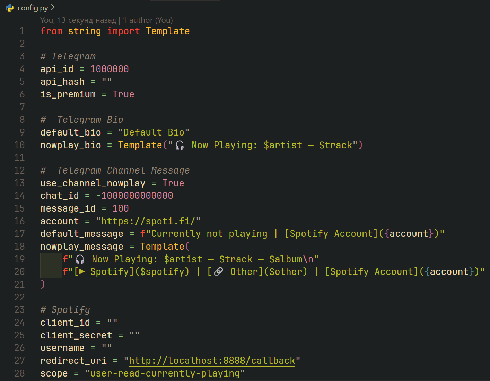

# Spotify to Telegram Bio

#### Отображает в статусе Telegram тот трек, который сейчас играет в Spotify / Display your current listen to a song from Spotify in the Telegram bio.


# Установка / Installation:

###### Склонировать репозиторий / Clone repository:
```bash
$ git clone https://github.com/L4zzur/spotify-to-telegram.git
```

###### Перейти в папку "spotify-to-telegram" / Go to "spotify-to-telegram" folder:
```bash
$ cd spotify-to-telegram
```

###### Установить зависимости с помощью pip / Install libraries using pip:
```bash
$ pip3 install -r requirements.txt
```

# Настройка / Setting up:

### Telegram:

1. Переходим на [my.telegram.org](https://my.telegram.org/) / Go to [my.telegram.org](https://my.telegram.org/)
2. Авторизуемся и нажимаем на API development tools / Authorize and click on API development tools
3. Cоздаем приложение и ставим тип web (можно указать любые названия, нам нужны только api_id и api_hash) / Create an application and set the web type (you can specify any names, we only need api_id and api_hash):

> Никому не сообщайте эти данные / Don't share this tokens with anyone

### Spotify
1. Переходим на [Spotify Dashboard](https://developer.spotify.com/dashboard/) / Go to [Spotify Dashboard](https://developer.spotify.com/dashboard/)
2. Авторизуемся и создаем новое приложение / Log in and create a new application 

3. Переходим в созданное приложение, а затем в настройки / Go to the created application, and then in settings

4. Изменяем строчку Redirect URIs на http://localhost:8888/callback / Changing the Redirect URIs line to http://localhost:8888/callback

> Никому не сообщайте эти данные / Don't share this tokens with anyone

### Python
1. Заходим в директорию со скриптом (Шаг 2 из установки) / Go to the script directory (step 2 from the installation)
2. Запускаем скрипт для настройки / Run the script to configure:
```bash
$ python3 setup.py
```
4. Заполняем все нужные данные, которые мы получили ранее, как просит скрипт / Fill all the necessary data that we received earlier, as requested by the script.
5. Авторизуем наше приложение Spotify через ссылку, которую вернул скрипт / Authorizing our Spotify application through the link that the script returned.
Либо же можно заполнить конфиг самостоятельно в файле config.py / Or you can fill in the config yourself in the config.py file



# Запуск / Run
1. Запускаем скрипт / Run script:
```bash
$ python3 main.py
```
2. Проходим авторизацию Telegram / Pass to the Telegram authorization 
3. Радуемся! / Enjoy!
