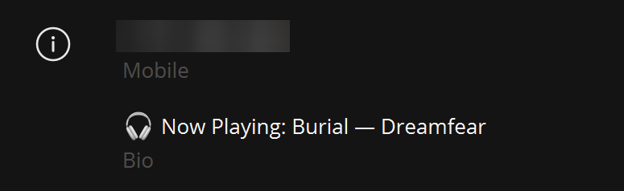

# Spotify to Telegram Bio

#### Display your currently playing song from Spotify in your Telegram bio and/or as a channel message.



# Installation
###### Clone the repository
```bash
$ git clone https://github.com/L4zzur/spotify-to-telegram.git
```

###### Go to the "spotify-to-telegram" folder
```bash
$ cd spotify-to-telegram
```

###### Create a virtual environment and activate it
```bash
$ python -m venv venv
$ source venv/bin/activate (or .\venv\Scripts\activate on Windows)
```

###### Install libraries using pip
```bash
$ pip install -r requirements.txt
```

# Setting up
### Telegram
1. Go to [my.telegram.org](https://my.telegram.org/)
2. Authorize and click on API development tools
3. Create an application and set the web type (you can specify any names; we only need api_id and api_hash):

> Don't share these tokens with anyone.

### Spotify
1. Go to [Spotify Dashboard](https://developer.spotify.com/dashboard/)
2. Log in and create a new application 

3. Go to the created application, and then to settings

1. Change the Redirect URIs line to http://localhost:8888/callback

> Don't share these tokens with anyone.

### Python
1. Go to the script directory (step 2 from the installation)
2. Run the script to configure (check you're has (venv)):
```bash
$ python setup.py
```
3. Fill in all the necessary data that we received earlier, as requested by the script.
4. Authorize Telegram account in terminal by following the instructions.


# Run
1. Run script:
```bash
$ python main.py
```
2. Proceed with the Spotify authorization (need to be done only once, but you need active login on Spotify in browser).
3. Enjoy!

# Installation on VPS/VDS
You can install the script on VPS/VDS using [systemd](systemd/README.md) insruction.
